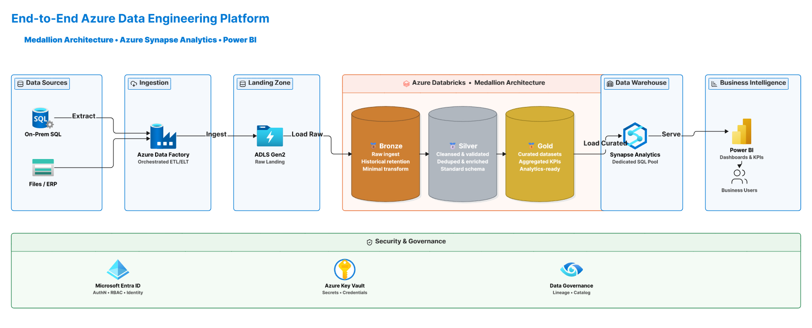
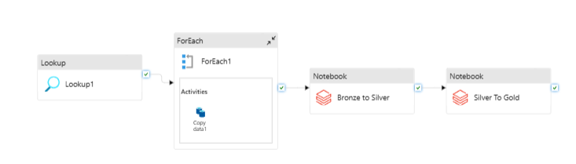
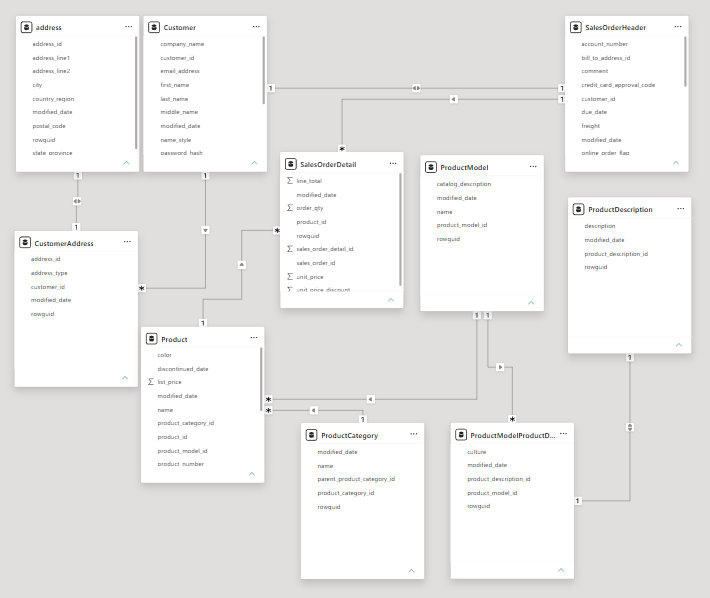
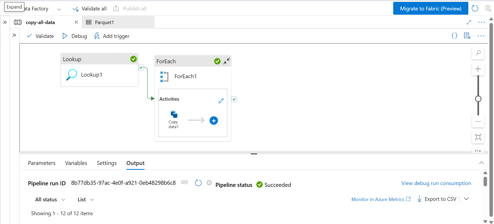

# End-to-End Azure Data Engineering & Analytics Platform

An enterprise-grade, end-to-end cloud data pipeline and analytical solution built on Microsoft Azure. This project implements a fully automated **Medallion Architecture** that extracts relational data from an on-premises ecosystem, processes it through structured validation tiers using **PySpark (Azure Databricks)**, warehouses the analytical models in **Azure Synapse Analytics**, and presents deep business insights via an interactive **Power BI** KPI dashboard.

---

## 📑 Table of Contents
- [📌 Project Overview](#-project-overview)
- [🎯 Business Objectives](#-business-objectives)
- [🛠️ Tools & Technologies](#️-tools--technologies)
- [📐 Data Platform & Solution Architecture](#-data-platform--solution-architecture)
- [📂 Relational Data Model (Source)](#-relational-data-model-source)
- [⚙️ Step-by-Step Pipeline Implementation](#️-step-by-step-implementation)
  - Phase 1: Secure Ingestion & Orchestration (ADF)
  - Phase 2: Multi-Stage Data Processing (Databricks Notebooks)
  - Phase 3: Enterprise Data Warehousing (Synapse Analytics)
  - Phase 4: Business Intelligence & Analytics (Power BI)
- [⭐ Data Warehouse Design](#-star-schema-data-warehouse-design)
- [💼 Dual-Role Impact: DE & DA Strengths](#-dual-role-impact-de--da-strengths)
- [📜 License](#-license)

---

## 📌 Project Overview

Organizations often face architectural siloing, resulting in a gap in understanding demographic behavior—specifically how traits like gender distribution correlate with regional and product category performance. 

This project bridges that gap by architecting a scalable **hybrid-cloud data ecosystem**. By extracting complex relational tables from an on-premises legacy environment into an automated Azure-native pipeline, raw data is systematically transformed into a robust dimensional model. The result is a unified platform satisfying both **Data Engineering (scalability, automation, governance)** and **Data Analytics (actionable KPIs, responsive reporting)** paradigms.

---

## 🎯 Business Objectives

* **KPI-Driven Dashboard:** Build a high-performance business dashboard reporting total items sold, gross sales revenue, and regional performance.
* **Demographic Segmentation:** Isolate customer acquisition and purchase behaviors broken down by gender across disparate product categories.
* **Interactive Slicing & Drilling:** Enable executives to seamlessly filter records down by temporal parameters (date ranges), product hierarchies, and customer demographics.
* **Automated Refreshes:** Schedule a daily orchestrated workflow to pull delta loads or snapshot changes, ensuring stakeholders always operate on accurate, real-time-adjacent data.

---

## 🛠️ Tools & Technologies

* **Orchestration / Ingestion:** Azure Data Factory (ADF) utilizing self-hosted and cloud integration runtimes.
* **Data Lakehouse Landing Zone:** Azure Data Lake Storage Gen2 (ADLS Gen2) structured with hierarchical namespaces.
* **Unity Catalog:** Implemented Unity Catalog for centralized governance, storage credentials, external locations, and access control across Medallion architecture layers.
* **Big Data Computation / Transformation:** Azure Databricks Spark clusters executing optimized Python/PySpark scripts.
* **Enterprise Data Warehouse (EDW):** Azure Synapse Analytics utilizing dedicated Synapse SQL pools for serving curated gold schemas.
* **Business Intelligence Reporting:** Power BI Desktop/Service executing DAX queries on imported/DirectQuery analytical models.
* **Security & Cloud Governance:** Microsoft Entra ID (RBAC), Azure Key Vault (Secret Scoping & Cryptographic String Management).

---

## 📐 Data Platform & Solution Architecture

The infrastructure adopts a highly resilient modern data warehouse design, moving fluidly through specialized layers:

### 🧱 System Architecture Blueprint
The following diagrams represent the technical blueprints implemented across the workspace:

#### 1. End-to-End Core Infrastructure

#### 2. Multi-Tier Medallion Execution Lifecycle

---

## 📂 Relational Data Model (Source)

The source system captures intricate enterprise activity across a multi-table relational schema containing customer registries, structural geographic vectors, nested sales orders, and product deep hierarchies.

Key Entities Ingested:
* `Customer` & `CustomerAddress` & `address` (Demographic and spatial dimensions)
* `SalesOrderHeader` & `SalesOrderDetail` (Transactional operational cores)
* `Product`, `ProductCategory`, `ProductModel`, and `ProductDescription` (Multi-tiered asset cataloging)

---

## ⚙️ Step-by-Step Pipeline Implementation

### Phase 1: Secure Ingestion & Orchestration (ADF)
1. **Dynamic Schema Discovering:** A parameterized `Lookup` activity queries the metadata repository of the database to fetch active table configurations.
2. **Iterative Collection (`ForEach` Loop):** Iterates over the array of targeted system tables dynamically.
3. **Optimized Multi-Threaded Copy:** The underlying `Copy Data` activity utilizes scalable throughput allocations to move raw tables safely into `.parquet` format within the **ADLS Gen2 Raw Landing Zone**.

### Phase 2: Multi-Stage Data Processing (Databricks Notebooks)
* **Bronze Lakehouse Zone:** Ingests the landing parquet files directly into append-only Delta tables with minimal transformation, preserving historical schema structures.
* **Silver Cleansing Zone:** PySpark scripts process records to handle Null structures, parse string anomalies, convert data types, and run deduplication scripts based on business keys.
* **Gold Curated Zone:** Aggregates records, builds star schema entities, and structures final business metrics ready for executive analytical consumption.

### Phase 3: Enterprise Data Warehousing (Synapse Analytics)
* The system loads curated Gold metrics efficiently into **Azure Synapse Analytics Serverless SQL Pools**.

### Phase 4: Business Intelligence & Analytics (Power BI)
* Connects directly to Azure Synapse serverless/dedicated endpoints.
* Constructs clean semantic layers utilizing DAX metrics for real-time calculations.
* Deploys rich visuals highlighting demographic slices, seasonal category metrics, and operational performance indicators.

---

This project showcases an extensive cross-functional skillset tailored to meet the demands of both **Data Engineering** and **Data Analytics**:

---

## 📜 License
This project is open-source and available under the [MIT License](LICENSE).
